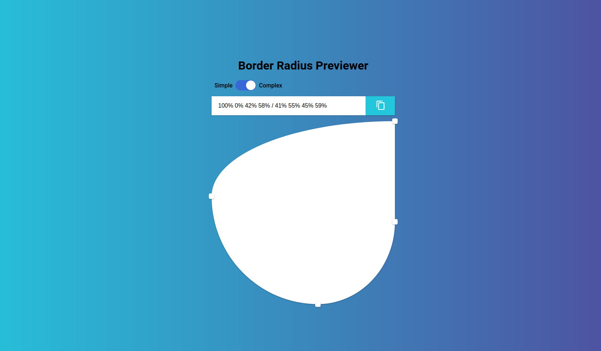

# Border Radius Previewer

A simple React app that allows you to modifie the border-radius values ​​and see live how it affects a div. This way you can quickly test border-radius values ​​without having to save or compile any css.

Live demo: https://rafaelnai.github.io/border-radius-previewer/

## Technologies

- React
- Typescript
- JSS

## Setup

`git clone https://github.com/rafaelnai/border-radius-previewer.git && cd border-radius-previewer`

In the project directory, to start in the dev mode run:

`yarn start`

To production mode run:

`yarn build`
